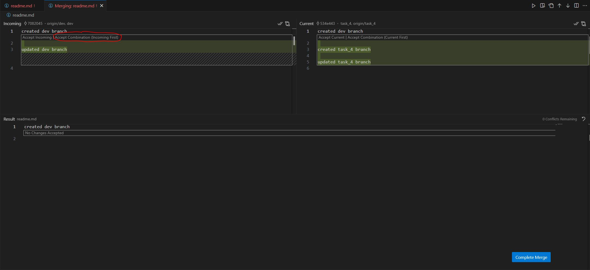
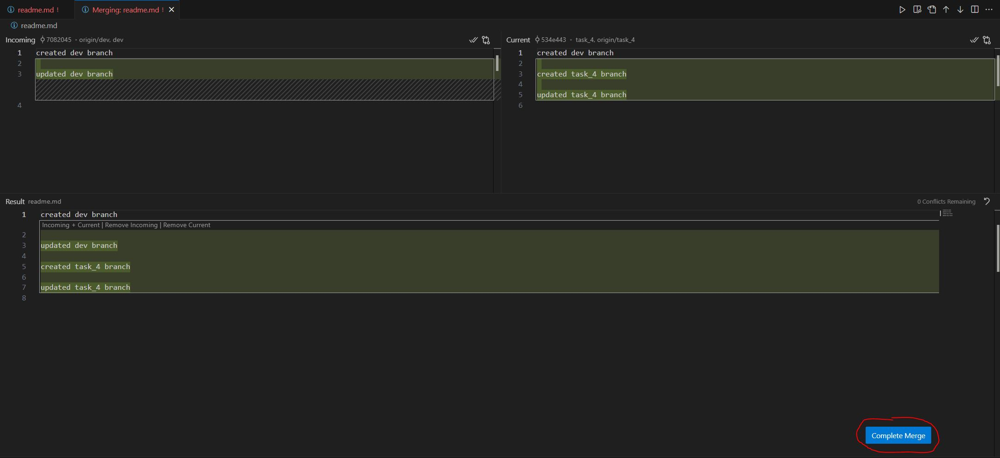

1. Переходимо в гілку dev

```bash
git checkout dev

```

2. Оновлюємо гілку dev

```bash
git pull origin

```

3. Переходимо в гілку task_4

```bash
git checkout task_4

```

4. Мержимо гілку dev в гілку task_4

```bash
git merge dev

```

5. Вирішуємо конфлікти

Відкриваємо merge editor, обираємо варіант Accept Combination (Incoming First)



Натискаємо Complete Merge



6. Пушимо оновлену гілку task_4

```bash
git add .
git commit -m 'updated from dev'
git push origin task_4

```
